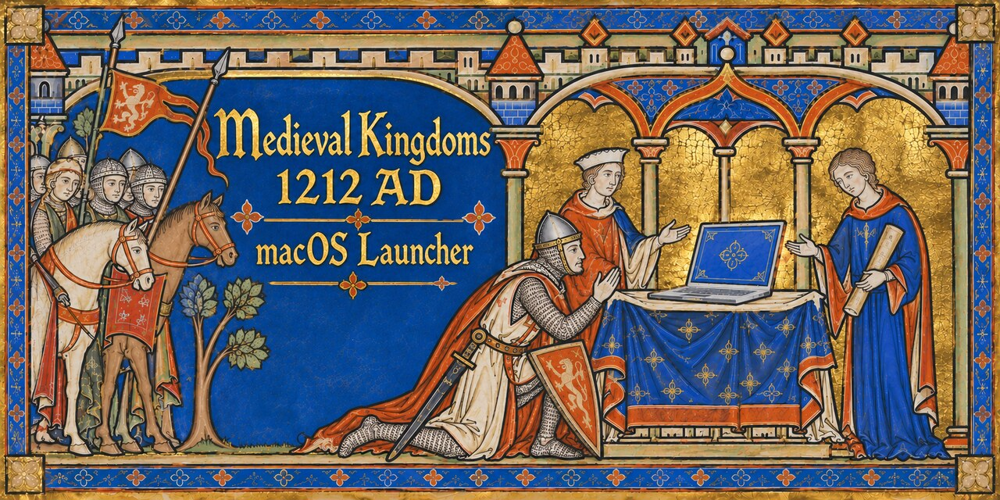
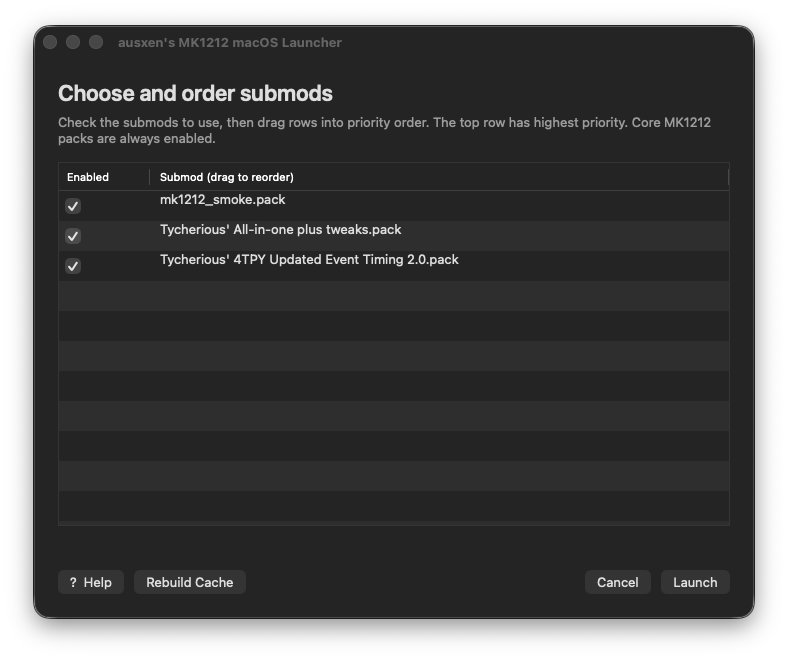
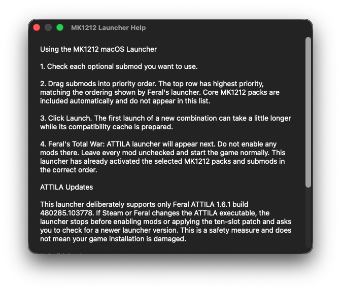
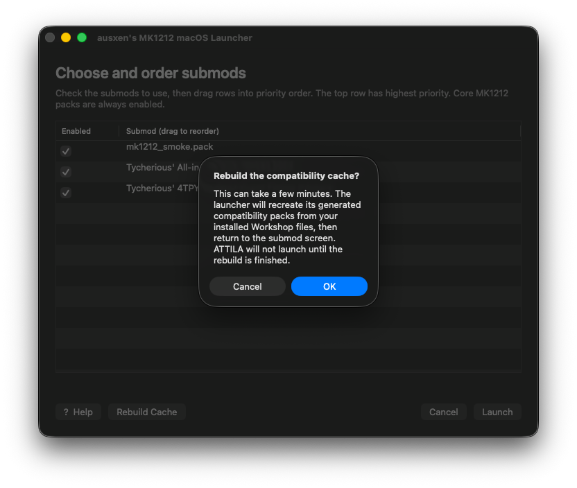

# MK1212 Mac Launcher

**You want to play MK1212 on your Mac. So did I. And you'd probably rather be gaming than reading a GitHub page. Fair.**

So I made a launcher that gets MK1212 working with the native Mac version of ATTILA. _No Windows. No Boot Camp. No emulator._

[**⬇ Download for Apple Silicon**](https://github.com/ausxen/MK1212_macOS/releases/latest/download/MK1212-Mac-Launcher.dmg)

_macOS 12+ · Apple Silicon · Feral Total War: ATTILA 1.6.1_

_Already know what you're doing? Download it, install it, launch it, march to Jerusalem._

_Never installed something like this from GitHub before? You're good. Instructions are right below._

---




## Install

1. **Download the launcher.**  
   _Want to verify the [SHA-256 checksum](https://github.com/ausxen/MK1212_macOS/releases/latest/download/MK1212-Mac-Launcher.dmg.sha256) first? Go for it. Otherwise, carry on._

2. **Open the DMG and run the installer.**  
   If macOS blocks it, use **Privacy & Security → Open Anyway**.

3. **Add `MK1212 Mac Launcher.app` to Steam as a Non-Steam Game.**  
   You'll find it in `/Applications/MK1212 Mac Launcher/`.

4. **Run the launcher from Steam.**  
   The first launch does most of the annoying setup for you.

5. **Pick your submods, drag them into the order you want, and hit Launch.**

6. **When the normal Feral launcher appears, leave its Mods section alone and start the game.**  
   MK1212 Mac Launcher has already handled the mods for you.

_That's it. Go play. Try not to get excommunicated._

## Requirements

You need:

- **An Apple Silicon Mac** running **macOS 12 or newer**
- **Steam** and the native **Feral macOS version of Total War: ATTILA**
- **Python 3.9 or newer** _(the launcher checks for this)_
- The **MK1212 core packs subscribed through Steam Workshop**

That's basically it. Keep Steam running when you launch the game through MK1212 Mac Launcher.

## If macOS Blocks the Installer

If macOS says it can't verify the installer:

1. **Right-click the installer and choose Open.**
2. If it still refuses, go to **System Settings → Privacy & Security** and click **Open Anyway**.

_If you're cautious about downloaded apps, verify the [SHA-256 checksum](https://github.com/ausxen/MK1212_macOS/releases/latest/download/MK1212-Mac-Launcher.dmg.sha256) first. That's what it's there for._

## Using the Launcher

The first time you run it, the launcher takes a few minutes to get set up. Grab another Monster from the fridge and check the groupchat while you wait. _I promise, it won't be that long._

After that:

- Check the submods you want to use.
- Drag them into priority order, with the highest priority at the top.
- Hit **Launch**.

If something gets weird later, **Rebuild Cache** recreates the launcher’s generated files from your Steam Workshop subscriptions. **Help** explains the basics without making you come back here and read all this again.

### What It Looks Like

**Help**



**Rebuild Cache**



## Supported Setup / What I Tested

_Alright, boring technical part. You should probably actually read this one._

This launcher is currently tested and supported with:

- **Apple Silicon / ARM64**
- **macOS 12 or newer**
- **Feral Total War: ATTILA 1.6.1**, build `480285.103778`
- ATTILA executable SHA-256: `13f5d523019f291f489353fa5d3661bc9a668bb2b0375d6c3201e01d74525c5e`
- **MK1212 Scripts, Cities, Base, Models 1–9, and Music**
- **Tycherious' 1212 Tweaks**
- **Realistic Smoke**
- **Tycherious' 4TPY**

I’ve tested it through extended campaign play, multiple battles, multiple ten-slot settlements, and the submods above.

**That does not mean I can promise it will work with every submod, every weird load order, or every future ATTILA update.** If you're using something I haven't tested, congratulations, you're a beta tester.

If something breaks, let me know. The more weird setups people try, the better I can make this thing.

## Troubleshooting

_Something broke? Don’t reach for the xans yet. Let's try the obvious stuff first._

**The launcher is taking forever the first time I run it.**  
Give it a few minutes. The first launch has more setup to do than later ones.

**Things were working, then Steam Workshop updated something and now they're weird.**  
Hit **Rebuild Cache** in the launcher and let it rebuild from your current Workshop files.

**I changed my submods and it's taking a while again.**  
That's normal the first time you use a new combination. Once it's built, later launches should be much quicker.

**The Feral launcher opened and none of my mods are checked.**  
_Good._ Leave them that way. MK1212 Mac Launcher already handled the mods. Just start the game.

**My submods are loading in the wrong order.**  
Drag them into the order you want in MK1212 Mac Launcher. **Highest priority goes at the top.**

**The launcher says “ATTILA has been updated.”**  
Your ATTILA executable has changed, so the launcher stopped rather than applying an untested compatibility patch. Check for a newer version of MK1212 Mac Launcher. Your game installation has not been modified.

**Everything has gone a bit sideways and I have no idea why.**  
Try **Rebuild Cache** first. If it still doesn't work, hit **Help** or send me a bug report.

## What This Actually Does

_If you just want to get back to charging knights into hapless archers, the short version is: it does the annoying compatibility stuff for you and cleans up after itself._

A slightly less short version:

- It finds your ATTILA install, MK1212 Workshop files, and optional submods.
- It builds a **separate compatibility cache** instead of editing your Workshop files.
- It handles the **mod load order** for you when you launch.
- It temporarily puts the files ATTILA needs in the right places, then removes them again when you're done.
- It leaves the actual **Feral ATTILA app untouched**. No editing it, no re-signing it, no replacing the executable.
- It enables **ten-slot settlements** with a small runtime memory patch while the game is running. Nothing permanent gets written into ATTILA itself.
- When you launch ATTILA normally through Steam without MK1212 Mac Launcher, it stays vanilla.

Basically, the launcher makes a reversible compatibility layer around the Mac version of ATTILA, starts the game, supervises the session, and cleans up afterward.

_You do not need to understand any of that to use it. I just know some of you were going to ask._

## Uninstall

There’s an uninstaller in `/Applications/MK1212 Mac Launcher/`.

Run it. It uninstalls the launcher. Obviously.

It also cleans up the compatibility files the launcher created, without touching your ATTILA install or Steam Workshop files.

## Technical Details

_This is the really nerdy section. If it makes your brain hurt, you can skip it._

### Verification

The launcher runs a quick verification before every launch.

If you're running from a source checkout, you can also run it manually:

```sh
./bin/mk1212-mac-verify --quick
```

That checks the current setup without re-hashing all of your Workshop files.

For the full paranoid version:

```sh
./bin/mk1212-mac-verify
```

That also recomputes the Workshop source hashes.

### Where It Puts Stuff

The launcher keeps its generated compatibility cache here:

```text
TotalWarAttilaData/.mk1212-cache
```

Its own state, manifest backups, activation history, and diagnostics live here:

```text
~/Library/Application Support/MK1212 Mac Launcher
```

If the launcher itself throws an error, check:

```text
~/Library/Logs/MK1212 Mac Launcher/last-launch-error.log
```

Cache rebuild progress goes here:

```text
~/Library/Logs/MK1212 Mac Launcher/rebuild-progress.log
```

**Don't post your raw state files or logs publicly.** They can contain local paths and other stuff nobody on the internet needs to know about your Mac.

### What It Does _Not_ Modify

The launcher does **not**:

- edit or re-sign the Feral ATTILA app
- modify your Steam Workshop packs in place
- permanently install mod files into ATTILA
- patch ATTILA's executable on disk

Workshop sources stay untouched. The launcher builds its own compatibility copies, activates what it needs for the current session, and removes that temporary state afterward.

### Ten-Slot Settlements

Ten-slot settlements are handled by a small ARM64 runtime patch.

The short version: while ATTILA is running, the launcher finds the relevant settlement-slot objects in memory and changes the slot count from six to ten.

It does **not** rewrite ATTILA's executable code or permanently modify the game. When ATTILA quits, the memory change disappears with it.

### Cleanup and Crash Recovery

During a normal exit, the launcher cleans up the temporary mod activation automatically.

If the game or launcher gets forcibly killed, your Mac crashes, or the power goes out at exactly the wrong moment, some temporary activation state can survive.

That's not catastrophic. The next launcher command checks for stale state and cleans it up before doing anything else.

### What Happens If ATTILA Gets Updated

The launcher checks the actual Feral ATTILA executable before it starts doing compatibility work.

If Steam or Feral updates ATTILA to a build I haven't tested yet, you'll get an **ATTILA has been updated** message and the launcher stops.

It does this **before activating mods, applying the ten-slot patch, or launching the game**, and it checks again immediately before activation in case the executable somehow changes halfway through the process.

Workshop updates are different. If MK1212 or one of your submods changes, the launcher uses its normal cache rebuild process instead.

_It's annoyingly cautious, I know. I'll try to get rid of this limitation in a future version._

## Build From Source

Requires:

- Apple Silicon / ARM64
- macOS 12+
- Python 3.9+
- Xcode Command Line Tools

Run the test suite:

```sh
python3 -m unittest discover -s tests -v
```

Build the runtime patch, launcher app, installer package, release bundle, and DMG:

```sh
./scripts/build-runtime-patch
./scripts/build-launcher-gui
./scripts/build-package
./scripts/build-release
./scripts/build-dmg
```

Release artifacts are written to `dist/`.

Local builds are ad-hoc signed by default. To use a Developer ID Application certificate, set:

```sh
CODESIGN_IDENTITY="Developer ID Application: …"
```

Developer ID signing does not by itself notarize the release. Notarization and stapling require the appropriate Apple Developer credentials and must be performed separately.

## Bug Reports

If something breaks, you can:

- open an issue here on GitHub
- DM me on Discord at `@austenballard`
- join the official MK1212 Discord server: https://discord.gg/75rPKkEDzC

When reporting a problem, include what you were trying to do, what happened, and any error message you saw.

**Please don’t post unredacted logs or state files publicly.** They can contain local file paths and other information that doesn’t need to be on the internet.

## Independent Project Notice

MK1212 Mac Launcher is an independent community project.

It is not affiliated with, endorsed by, or supported by Creative Assembly, Feral Interactive, SEGA, Valve, or the Medieval Kingdoms 1212 AD development team.

The launcher does not include or redistribute Total War: ATTILA, MK1212, Steam Workshop content, or other proprietary game or mod files. You must own Total War: ATTILA and obtain MK1212 and any submods through their authorized distribution channels.

